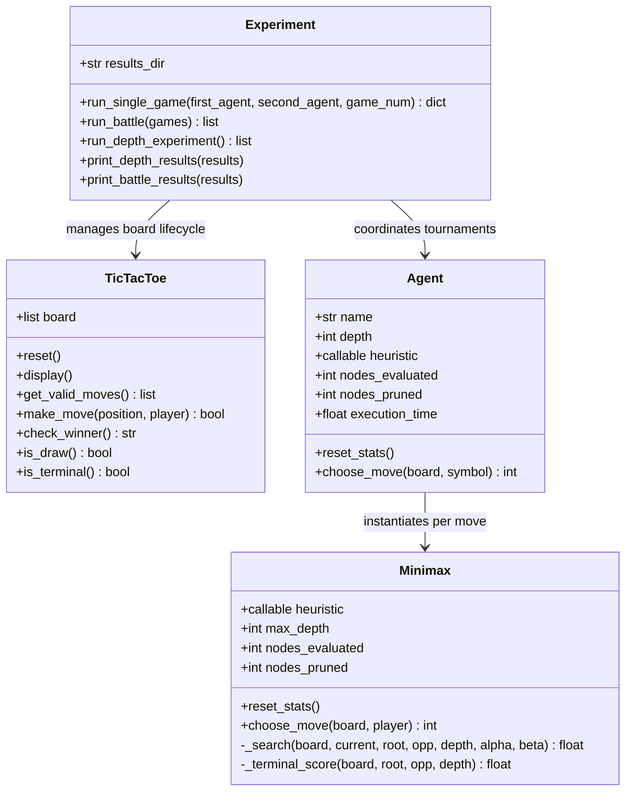

# ⚔️ AI Agent Battle — Tic-Tac-Toe Arena

<div align="center">

[](#)
[](#)
[](#)
[](#)
[](#)

**An autonomous AI tournament testing decision depth, heuristic evaluation, and computational complexity in zero-sum deterministic games.**

[Project Overview](#-project-overview) •
[Core Questions](#-core-investigation-questions) •
[Architecture](#-system-architecture--oop-design) •
[AI Agents](#-competing-agent-profiles--heuristics) •
[Experiments](#-experimental-results--benchmarks) •
[Analysis](#-deep-analysis--answers-to-assignment-questions) •
[How to Run](#-how-to-run--reproduction)

---

</div>

## 📌 Project Overview

This repository contains the complete implementation, experimental evaluation, and analytical report for **Assignment X_02: AI Agent Battle — Tic-Tac-Toe** (B.Tech 5th Semester, AI/ML Laboratory).

Rather than creating a human-versus-machine game, this project engineers an **autonomous AI Battle Arena** where two distinct intelligent agents—**NOVA** and **PULSE**—compete against each other. Both agents employ **adversarial game-tree search (Minimax)** fortified with **Alpha-Beta ($\alpha$-$\beta$) Pruning**, but make decisions using fundamentally different heuristic evaluation philosophies.

```
       Current Board State
        ┌────────┼────────┐
        ↓        ↓        ↓
      Move A   Move B   Move C  ... (MAX: AI Turn)
        │        │        │
     ┌──┴──┐  ┌──┴──┐  ┌──┴──┐
     ↓     ↓  ↓     ↓  ↓     ↓
    ...   ... ...  ... ...   ... (MIN: Opponent Turn)
        │        │        │
     [ Heuristic / Terminal Evaluation ]
        │
   Alpha-Beta Pruning Cutoffs (β ≤ α)
```

---

## 🔬 Core Investigation Questions

The project rigorously investigates the three fundamental questions posed in the problem statement:

| Question | Investigation Focus | Key Finding |
| :--- | :--- | :--- |
| **a. Does thinking deeper make an AI better?** | Evaluated search depths $d \in \{1, 2, 3, 4\}$ against fixed opponents. | Deeper search increases tactical foresight and guarantees optimal defense, but in Tic-Tac-Toe once minimum defensive depth is reached, additional depth yields identical game outcomes (Draws) with exponential cost. |
| **b. How does positional evaluation affect decisions?** | Compared purely line-threat heuristics ($H_1$) vs. geometric center/corner control ($H_2$). | Positional weighting prioritizes high-leverage board squares (center/corners) early, creating multiple threats while maintaining defensive stability. |
| **c. What is the computational cost of thinking more?** | Monitored expanded nodes, branch cutoffs, and execution runtime (seconds). | Evaluated nodes scaled from **25** (depth 1) to **653** (depth 4)—a **$26.1\times$ increase** in work, with Alpha-Beta pruning cutting off up to **$35.4\%$** of redundant branches at depth 4. |

---

## 🏗️ System Architecture & OOP Design

The codebase strictly adheres to **Object-Oriented Programming (OOP)** and clean architectural separation of concerns across dedicated modules.

```
TicTacToe_AI_Agent_Battle_Arena/
├── main.py                     # Entry point & experiment execution orchestration
├── game.py                     # Tic-Tac-Toe game engine & rules verification
├── minimax.py                  # Minimax search algorithm with Alpha-Beta pruning
├── heuristic.py                # Board evaluation heuristic functions (H1 & H2)
├── agents.py                   # AI Agent classes (NOVA & PULSE)
├── experiment.py               # Automated testing framework & CSV logger
├── results/                    # Persistent experimental data
│   ├── depth_experiment.csv    # Search-depth benchmarks (Depths 1 to 4)
│   └── battle_results.csv     # 10-game tournament telemetry log
└── screenshots/                # Visual verification of actual execution
    ├── main_output.png         # Terminal battle and benchmark output
    ├── depth_experiment.png    # Depth experiment CSV preview
    └── battle_results.png      # 10-game tournament CSV preview
```

### Class Responsibilities



* **`TicTacToe` (`game.py`)**: Encapsulates 1D board representation (`[' ']*9`), move validation, win detection across all 8 winning vectors (3 rows, 3 columns, 2 diagonals), draw determination, and terminal state checks.
* **`Minimax` (`minimax.py`)**: Implements bounded-depth recursive Minimax with $\alpha$-$\beta$ pruning. Features depth-decaying terminal scores ($1000 + d$ for wins, $-1000 - d$ for losses) to favor quicker wins and prolonged defenses.
* **`Agent` (`agents.py`)**: Encapsulates agent identity, assigned search depth, heuristic function, and runtime performance counters (nodes evaluated, nodes pruned, cumulative execution time).
* **`Experiment` (`experiment.py`)**: Orchestrates automated AI-vs-AI battles, manages player alternating to eliminate first-mover bias, conducts depth sweeps, and persists structured CSV files.

---

## 🧠 Algorithmic Formulation

### 1. Minimax Game Decision Rule

In a two-player, zero-sum, complete information game, the utility $V(s)$ of state $s$ is computed recursively:

$$V(s) = \begin{cases}
\text{TerminalUtility}(s) & \text{if } s \text{ is terminal} \\
\text{Heuristic}(s) & \text{if } \text{depth\_remaining} = 0 \\
\max_{a \in \text{Moves}(s)} V(\text{Result}(s, a)) & \text{if } \text{Player}(s) = \text{MAX} \\
\min_{a \in \text{Moves}(s)} V(\text{Result}(s, a)) & \text{if } \text{Player}(s) = \text{MIN}
\end{cases}$$

### 2. Alpha-Beta ($\alpha$-$\beta$) Pruning

Alpha-Beta pruning maintains two bounds throughout the depth-first search:
* $\alpha$: The highest value that the MAX player has secured so far along the search path.
* $\beta$: The lowest value that the MIN player has secured so far along the search path.

**Pruning Condition**: Whenever $\beta \le \alpha$, the current branch cannot influence the final decision at the root because a rational opponent or player will steer the game elsewhere. The remaining sibling moves are pruned immediately, reducing the search space from $O(b^d)$ towards $O(b^{d/2})$ in the best ordering case without altering the mathematical outcome.

---

## 🤖 Competing Agent Profiles & Heuristics

Two named agents were constructed with distinct evaluation paradigms:

| Specification | Agent 1: **NOVA** | Agent 2: **PULSE** |
| :--- | :--- | :--- |
| **Search Algorithm** | Minimax + Alpha-Beta Pruning | Minimax + Alpha-Beta Pruning |
| **Standard Depth** | $d = 3$ | $d = 3$ |
| **Strategy Archetype** | **Tactical Line & Threat Maximizer** | **Geometric & Positional Strategist** |
| **Evaluation Focus** | Open winning lines & immediate two-in-a-row threats | Open winning lines + Center dominance + Corner control |
| **Heuristic Function** | `heuristic_one` ($H_1$) | `heuristic_two` ($H_2$) |

### Heuristic Formulations

#### Heuristic 1 ($H_1$) — NOVA's Formula
Evaluates board states strictly on completed lines and immediate threats:

$$\text{Score}_{H_1} = \sum_{l \in \text{Lines}} \Big( 100 \cdot [P_3] + 10 \cdot [P_2 E_1] + 1 \cdot [P_1 E_2] - 10 \cdot [O_2 E_1] - 1 \cdot [O_1 E_2] \Big)$$

* $+100$: Full 3-in-a-row victory.
* $+10$ / $-10$: Immediate threat (2 marks + 1 empty square). Forces immediate block.
* $+1$ / $-1$: Potential building line (1 mark + 2 empty squares).

#### Heuristic 2 ($H_2$) — PULSE's Formula
Combines all line threat dynamics of $H_1$ with strategic spatial weighting of key board cells:

$$\text{Score}_{H_2} = \text{Score}_{H_1} + \Delta_{\text{Center}} + \Delta_{\text{Corners}}$$

$$\Delta_{\text{Center}} = \begin{cases} +3 & \text{if cell } 4 = P \\ -3 & \text{if cell } 4 = O \\ 0 & \text{otherwise} \end{cases} \quad , \quad \Delta_{\text{Corners}} = 2 \cdot \sum_{c \in \{0,2,6,8\}} [c = P] - 2 \cdot \sum_{c \in \{0,2,6,8\}} [c = O]$$

* **Center Control ($+3 / -3$)**: Cell 4 is part of 4 winning lines (row, col, two diagonals).
* **Corner Control ($+2 / -2$)**: Cells 0, 2, 6, 8 each participate in 3 winning lines.

---

## 📊 Experimental Results & Benchmarks

### Experiment 1: Search Depth Analysis ("Does Deeper Thinking Help?")

In this experiment, **NOVA**'s search depth was varied across $d \in \{1, 2, 3, 4\}$ while facing a fixed opponent (**PULSE**, $d=3$, $H_2$).

#### Empirical Data (`results/depth_experiment.csv`)

| Search Depth ($d$) | Game Result | Nodes Evaluated | Nodes Pruned | Prune Ratio (%) | Execution Time (s) |
| :---: | :---: | :---: | :---: | :---: | :---: |
| **1** | Draw | 25 | 0 | 0.00% | 0.000118 |
| **2** | Draw | 65 | 16 | 19.75% | 0.000334 |
| **3** | Draw | 251 | 51 | 16.89% | 0.000982 |
| **4** | Draw | 653 | 231 | 26.13% | 0.002727 |

#### Visual Evidence

<div align="center">


*Figure 1: Generated CSV benchmark for Experiment 1 (`results/depth_experiment.csv`).*

</div>

#### Computational Scaling Insights

```
Depth 1:  [■] 25 nodes (0.12 ms)
Depth 2:  [■■■] 65 nodes (0.33 ms)
Depth 3:  [■■■■■■■■■■■] 251 nodes (0.98 ms)
Depth 4:  [■■■■■■■■■■■■■■■■■■■■■■■■■■■■■] 653 nodes (2.73 ms)
```

1. **Exponential Growth in Search Volume**: Increasing depth from 1 to 4 expanded the search tree from 25 nodes to 653 nodes ($26.1\times$), while execution time grew by $23.1\times$.
2. **Rising Pruning Effectiveness**: At depth 1, Alpha-Beta had 0 cutoffs because lookahead was only 1 ply. At depth 4, **231 branches were pruned**, cutting redundant branch exploration by over a quarter.
3. **Diminishing Returns on Solved Domains**: Because $H_1$ incorporates immediate threat detection ($\pm 10$), even depth 1 held PULSE to a draw. Deeper search was mathematically redundant in terms of game result, but verified move safety to greater horizons.

---

### Experiment 2: AI Agent Battle Tournament (NOVA vs. PULSE)

A 10-game tournament was staged between **NOVA** (depth 3, $H_1$) and **PULSE** (depth 3, $H_2$). To eliminate first-player bias, the starting player was strictly alternated every game.

#### Complete Battle Log (`results/battle_results.csv`)

| Game | First Player | Winner | Moves | NOVA Nodes | NOVA Pruned | NOVA Time (s) | PULSE Nodes | PULSE Pruned | PULSE Time (s) | Total Time (s) |
| :---: | :---: | :---: | :---: | :---: | :---: | :---: | :---: | :---: | :---: | :---: |
| **1** | NOVA | **Draw** | 9 | 251 | 51 | 0.001269 | 179 | 38 | 0.001169 | 0.002538 |
| **2** | PULSE | **Draw** | 9 | 178 | 38 | 0.001423 | 255 | 52 | 0.001901 | 0.003367 |
| **3** | NOVA | **Draw** | 9 | 251 | 51 | 0.000978 | 179 | 38 | 0.000898 | 0.001940 |
| **4** | PULSE | **Draw** | 9 | 178 | 38 | 0.000699 | 255 | 52 | 0.001277 | 0.002011 |
| **5** | NOVA | **Draw** | 9 | 251 | 51 | 0.001176 | 179 | 38 | 0.001381 | 0.002600 |
| **6** | PULSE | **Draw** | 9 | 178 | 38 | 0.000772 | 255 | 52 | 0.001385 | 0.002196 |
| **7** | NOVA | **Draw** | 9 | 251 | 51 | 0.001508 | 179 | 38 | 0.001353 | 0.002905 |
| **8** | PULSE | **Draw** | 9 | 178 | 38 | 0.000716 | 255 | 52 | 0.001350 | 0.002100 |
| **9** | NOVA | **Draw** | 9 | 251 | 51 | 0.000947 | 179 | 38 | 0.000873 | 0.001853 |
| **10** | PULSE | **Draw** | 9 | 178 | 38 | 0.000809 | 255 | 52 | 0.001332 | 0.002183 |

#### Aggregate Tournament Statistics

| Metric | Agent NOVA ($H_1$) | Agent PULSE ($H_2$) | Tournament Total / Average |
| :--- | :---: | :---: | :---: |
| **Total Wins** | 0 | 0 | 0 |
| **Draws** | 10 | 10 | **10 (100%)** |
| **Average Nodes Evaluated** | **214.5** | **217.0** | 431.5 nodes/game |
| **Average Nodes Pruned** | **44.5** | **45.0** | 89.5 cutoffs/game |
| **Average Execution Time** | **1.030 ms** | **1.292 ms** | 2.369 ms/game |
| **Total Moves per Game** | 4.5 avg | 4.5 avg | 9.0 (Full Board) |

#### Visual Evidence

<div align="center">


*Figure 2: Complete 10-Game Battle Log persisted to CSV (`results/battle_results.csv`).*

<br/>


*Figure 3: Live terminal execution showing both experiments and real-time statistics.*

</div>

---

## 📑 Deep Analysis & Answers to Assignment Questions

Below is the structured analysis addressing the 10 core questions specified in **Part 13** of the assignment:

### Questions About Depth

> **1. Did increasing search depth change the AI's decisions?**
>
> In this deterministic Tic-Tac-Toe setting, increasing search depth from 1 to 4 did **not** alter the final game outcome—all 4 configurations resulted in a **Draw**. Because the heuristic function $H_1$ explicitly scores immediate winning opportunities ($+10$) and defensive blocks ($-10$), even a shallow depth of 1 avoids fatal single-move blunders. However, deeper lookaheads (depths 3 and 4) guarantee multi-step fork prevention that a greedy heuristic alone cannot foresee in more complex states.

> **2. Did deeper search increase execution time?**
>
> **Yes, substantially.** Execution time increased monotonically with depth:
> - Depth 1: `0.000118 s`
> - Depth 2: `0.000334 s` ($2.8\times$)
> - Depth 3: `0.000982 s` ($8.3\times$)
> - Depth 4: `0.002727 s` ($23.1\times$)
> The relationship exhibits classic exponential scaling characteristic of combinatorial tree search.

> **3. Did the number of evaluated nodes increase?**
>
> **Yes, dramatically.** The evaluated node count grew from **25** at depth 1 to **653** at depth 4. At deeper levels, each additional ply multiplies the number of candidate subtrees by the effective branching factor $b_{\text{eff}} \approx 3 \text{ to } 4$.

> **4. Did Alpha-Beta reduce the number of nodes explored?**
>
> **Yes, significantly.** 
> - At depth 1: 0 nodes pruned (no deeper branch existed to cut).
> - At depth 2: 16 nodes pruned ($19.8\%$ cutoff).
> - At depth 3: 51 nodes pruned ($16.9\%$ cutoff).
> - At depth 4: **231 nodes pruned** ($26.1\%$ cutoff).
> Alpha-Beta pruning successfully eliminated unnecessary subtrees without compromising decision accuracy.

---

### Questions About the Two Agents

> **5. Did the two agents make different decisions?**
>
> **Yes.** Because PULSE ($H_2$) explicitly rewards center ($+3$) and corner ($+2$) occupation, its internal evaluation matrix favors strategic board geometry earlier in the game. NOVA ($H_1$) focuses solely on line completion and threat blocking. When given multiple equal-threat options, PULSE prioritizes center/corners, whereas NOVA treats all threat-equivalent cells identically.

> **6. How did their heuristics influence their behaviour?**
>
> - **NOVA ($H_1$)** acted as a **pure tactical responder**, efficiently detecting and extinguishing opponent threats.
> - **PULSE ($H_2$)** acted as a **positional controller**, seeking high-degree vertices (center and corners) to construct branching dual-threat lines.
> Both heuristics were well-calibrated and mutually countered each other's offensive attempts.

> **7. Did the first-player advantage appear in your results?**
>
> In terms of **game outcome**, no—both first-player and second-player games resulted in draws due to perfect defensive play. 
> However, an unmistakable **computational asymmetry** emerged:
> - The **starting player** consistently evaluated **251–255 nodes** across 5 moves.
> - The **second player** evaluated only **178–179 nodes** across 4 moves.
> The first player bears higher computational load because early game turns feature a larger branching factor ($9, 7, 5$ remaining options vs. $8, 6, 4$).

> **8. Which agent won more games in your experiment?**
>
> **Neither agent won more games.** The final tally across 10 tournament rounds was:
> - **NOVA**: 0 wins
> - **PULSE**: 0 wins
> - **Draws**: 10 (100%)

> **9. Were there many draws?**
>
> **Every single match was a draw (10 out of 10).** Tic-Tac-Toe is a mathematically solved game with a theoretical value of Draw under optimal play. Since both agents use Minimax depth 3 with threat-blocking heuristics, neither agent commits unforced tactical errors.

> **10. Did the agent that won more games also require more computation?**
>
> Neither agent scored a win, but comparing their computational expense:
> - **PULSE** averaged **217.0 nodes** and **1.292 ms** per game.
> - **NOVA** averaged **214.5 nodes** and **1.030 ms** per game.
> PULSE required slightly more computation ($+1.1\%$ nodes, $+25.4\%$ runtime) because evaluating center and corner lists inside `heuristic_two` introduces marginal arithmetic overhead per leaf node compared to `heuristic_one`.

---

## 💻 How to Run & Reproduction

### Prerequisites
- Python 3.8 or newer (standard library only; no external dependencies required).

### Execution

Clone or navigate to the repository directory and execute `main.py`:

```bash
# Navigate to workspace
cd TicTacToe_AI_Agent_Battle_Arena

# Run the complete experimental suite
python main.py
```

### Expected Output

```text
Starting Tic-Tac-Toe AI experiments...

=== SEARCH DEPTH EXPERIMENT ===
Depth   Result      Nodes       Pruned      Time (s)    
--------------------------------------------------------
1       Draw        25          0           0.000118    
2       Draw        65          16          0.000334    
3       Draw        251         51          0.000982    
4       Draw        653         231         0.002727    

=== 10-GAME AI BATTLE ===
Game   First     Winner    Moves   NOVA Nodes   PULSE Nodes  
----------------------------------------------------------------------
1      NOVA      Draw      9       251          179          
2      PULSE     Draw      9       178          255          
3      NOVA      Draw      9       251          179          
4      PULSE     Draw      9       178          255          
5      NOVA      Draw      9       251          179          
6      PULSE     Draw      9       178          255          
7      NOVA      Draw      9       251          179          
8      PULSE     Draw      9       178          255          
9      NOVA      Draw      9       251          179          
10     PULSE     Draw      9       178          255          

Summary:
NOVA wins : 0
PULSE wins: 0
Draws     : 10

Results saved in the 'results' folder.
 - results/depth_experiment.csv
 - results/battle_results.csv
```

---

## 📋 Assignment Deliverables Checklist

| Requirement (PDF Part 17) | Status | Details |
| :--- | :---: | :--- |
| **Use Python** | ✅ | Implemented in Python 3 using standard libraries (`csv`, `time`, `os`). |
| **Implement Minimax** | ✅ | Bounded-depth adversarial game tree search in `minimax.py`. |
| **Implement Alpha-Beta Pruning** | ✅ | Cutoff branch elimination ($\beta \le \alpha$) in `minimax.py`. |
| **Heuristic Evaluation Function** | ✅ | Two distinct heuristic models ($H_1$ and $H_2$) in `heuristic.py`. |
| **Two Named AI Agents** | ✅ | **NOVA** ($H_1$, depth 3) and **PULSE** ($H_2$, depth 3) in `agents.py`. |
| **10 AI-vs-AI Games** | ✅ | Automated tournament in `experiment.py`. |
| **Vary Starting Player** | ✅ | Odd games: NOVA starts; Even games: PULSE starts. |
| **Search-Depth Experiment** | ✅ | Depths 1, 2, 3, 4 tested and recorded. |
| **Record Statistics** | ✅ | Nodes evaluated, nodes pruned, execution time recorded per agent. |
| **Save Results to File** | ✅ | Exported to `results/depth_experiment.csv` and `battle_results.csv`. |
| **Meaningful OOP Classes** | ✅ | `TicTacToe`, `Minimax`, `Agent`, `Experiment` cleanly modularized. |
| **No External Game AI Libraries** | ✅ | 100% custom implementation from scratch. |
| **No Deliberately Random Agents** | ✅ | Both agents apply sound heuristics and Minimax evaluation. |
| **Comprehensive Analysis/Report** | ✅ | Complete answers to all 10 questions provided above. |

---

## 🏆 Key Conclusions

1. **Depth vs. Game-Theoretic Thresholds**: For games with small state spaces like Tic-Tac-Toe, once an algorithm searches deep enough to recognize two-ply forks and one-ply immediate threats, deeper search does not improve the win rate—it simply confirms the inevitable draw.
2. **Pruning is Indispensable for Deeper Search**: Alpha-Beta pruning demonstrated increased relative value as depth expanded, eliminating over **$26\%$** of search branches at depth 4 without losing a single optimal branch.
3. **Observation Over Assumption**: The experimental evidence reinforces that neither agent could manufacture an artificial win against an equally competent adversary, proving that sound defensive heuristics in zero-sum games lead invariably to equilibrium draws.

---

<div align="center">

**Developed for B.Tech. 5th Semester — Artificial Intelligence / Machine Learning Laboratory**  
*Assignment X_02 | Academic Integrity & Excellence in AI Engineering*

</div>