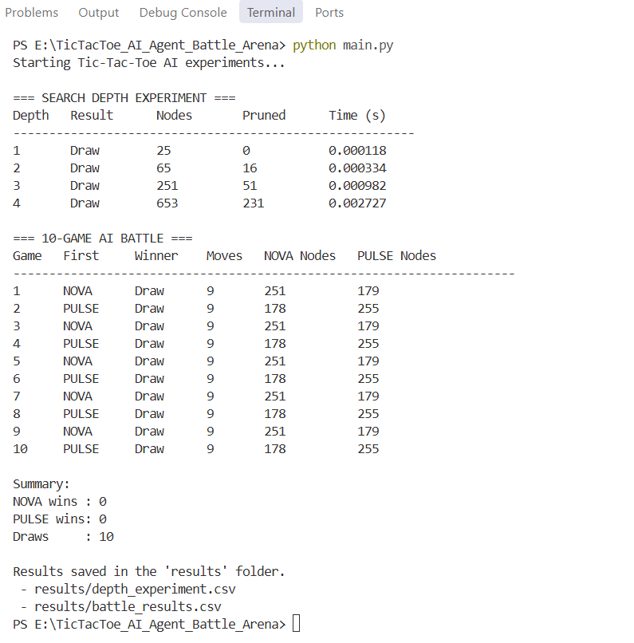
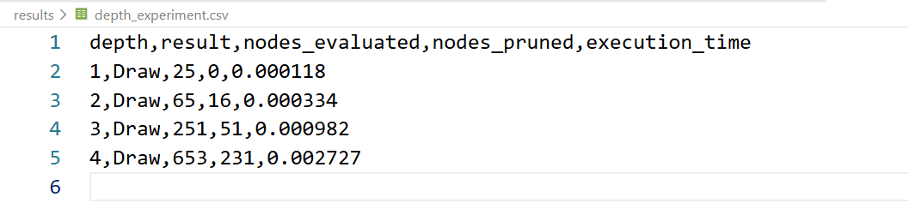
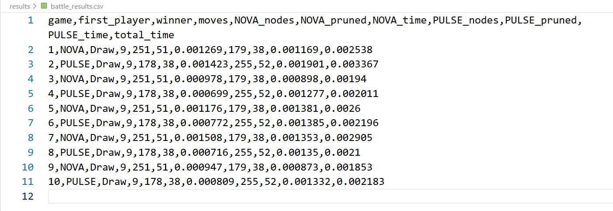

# AI Agent Battle — Tic-Tac-Toe

**AI/ML Laboratory — Assignment X_02 | B.Tech. 5th Semester**

This project is an implementation of an autonomous AI-vs-AI Tic-Tac-Toe system. Rather than having a human play against the computer, two AI agents—**NOVA** and **PULSE**—compete against each other using Minimax search and Alpha-Beta pruning.

The goal of this assignment is to investigate three main questions:
1. **Does thinking deeper make an AI better?**
2. **How does the way an AI evaluates a position affect its decisions?**
3. **What is the computational cost of making an AI think more?**

---

## Table of Contents
- [Project Overview](#project-overview)
- [Project Structure & OOP Design](#project-structure--oop-design)
- [How the AI Works](#how-the-ai-works)
  - [Minimax Search](#minimax-search)
  - [Alpha-Beta Pruning](#alpha-beta-pruning)
  - [Heuristics: NOVA vs. PULSE](#heuristics-nova-vs-pulse)
- [Experiment 1: Search Depth Analysis](#experiment-1-search-depth-analysis)
- [Experiment 2: 10-Game Tournament (NOVA vs. PULSE)](#experiment-2-10-game-tournament-nova-vs-pulse)
- [Analysis & Answers to Assignment Questions](#analysis--answers-to-assignment-questions)
- [How to Run the Code](#how-to-run-the-code)
- [Screenshots](#screenshots)

---

## Project Overview

In this project, the game board is a 3×3 grid stored internally as a 9-element list:
`[' ', ' ', ' ', ' ', ' ', ' ', ' ', ' ', ' ']`.

The system runs fully automated matches between two intelligent agents:
- **NOVA**: Uses Minimax with Alpha-Beta pruning, default search depth of 3, and **Heuristic 1 (H1)** which evaluates winning lines and immediate two-in-a-row threats.
- **PULSE**: Uses Minimax with Alpha-Beta pruning, default search depth of 3, and **Heuristic 2 (H2)** which builds upon line potential while prioritizing center and corner control.

All game statistics (moves, winner, nodes evaluated, nodes pruned, and execution time) are tracked and automatically written to CSV files in the `results/` directory.

---

## Project Structure & OOP Design

The project is split into clean, modular files according to object-oriented principles:

```text
TicTacToe_AI_Agent_Battle_Arena/
├── main.py                     # Entry point to run experiments and view outputs
├── game.py                     # TicTacToe class (board state, rules, win/draw detection)
├── minimax.py                  # Minimax search implementation with Alpha-Beta pruning
├── heuristic.py                # Board evaluation functions (heuristic_one, heuristic_two)
├── agents.py                   # Agent class and agent factory
├── experiment.py               # Experiment class (runs depth sweeps, matches, CSV export)
├── README.md                   # Project documentation and experiment report
├── results/
│   ├── depth_experiment.csv    # Saved data for Experiment 1
│   └── battle_results.csv     # Saved data for Experiment 2
└── screenshots/
    ├── main_output.png         # Terminal output screenshot
    ├── depth_experiment.png    # Depth experiment CSV screenshot
    └── battle_results.png      # 10-game battle CSV screenshot
```

### Class Responsibilities

- **`TicTacToe` (`game.py`)**: Manages the 3×3 board, move validation, checking for 3-in-a-row along all 8 winning lines (3 horizontal, 3 vertical, 2 diagonal), detecting draws, and checking if the game has reached a terminal state.
- **`Minimax` (`minimax.py`)**: Implements bounded-depth recursive search. If the game reaches a terminal state, it scores the outcome (+1000 for win, -1000 for loss, 0 for draw). If max depth is reached before the game finishes, it calls the agent's heuristic evaluation function. Tracks evaluated nodes and pruned branches.
- **`Agent` (`agents.py`)**: Represents an AI player with a name, configured search depth, and evaluation heuristic. Coordinates calls to `Minimax.choose_move()` and accumulates move-by-move timing and search metrics.
- **`Experiment` (`experiment.py`)**: Manages match simulations, alternates starting players between games to eliminate first-player bias, executes depth experiments (depths 1 to 4), prints summary tables to console, and writes results to CSV files.

---

## How the AI Works

### Minimax Search

At any given turn, the current agent (MAX) explores possible legal moves. For each move, it considers what the opponent (MIN) might do in response, and what counter-moves it can make next.

- When a terminal state is reached:
  - **Win**: Score = `+1000 + depth_remaining` (the depth bonus encourages the AI to win as quickly as possible).
  - **Loss**: Score = `-1000 - depth_remaining` (encourages the AI to delay losses as long as possible).
  - **Draw**: Score = `0`.
- When maximum search depth is reached without the game ending, the AI relies on a heuristic scoring function to evaluate the quality of the non-terminal board.

### Alpha-Beta Pruning

Standard Minimax examines every branch of the game tree. Alpha-Beta pruning speeds up the search without changing the move chosen:
- **$\alpha$** maintains the best value the maximizing player can guarantee so far.
- **$\beta$** maintains the best value the minimizing player can guarantee so far.

Whenever $\beta \le \alpha$, the remaining sibling moves in that branch cannot affect the root decision, so search in that subtree stops immediately (pruned).

### Heuristics: NOVA vs. PULSE

Neither agent is random; both are designed to play rationally with different evaluation styles.

#### 1. NOVA — Heuristic 1 (`heuristic_one`)
Focuses on winning line completion and threat defense:
- $+100$ if the player has 3 in a line (win).
- $+10$ if the player has 2 marks and 1 empty cell (immediate winning threat).
- $+1$ if the player has 1 mark and 2 empty cells (potential building line).
- $-10$ if the opponent has 2 marks and 1 empty cell (opponent threat to block).
- $-1$ if the opponent has 1 mark and 2 empty cells.

#### 2. PULSE — Heuristic 2 (`heuristic_two`)
Combines all line counts from Heuristic 1 with positional board control:
- Base score calculated from line counts (same as H1).
- **Center Control**: $+3$ if PULSE controls the center cell (index 4), $-3$ if the opponent holds it. (The center is the most valuable square because it belongs to 4 winning lines).
- **Corner Control**: $+2$ for each corner held (indices 0, 2, 6, 8) and $-2$ for each corner held by the opponent. (Corners belong to 3 winning lines each).

---

## Experiment 1: Search Depth Analysis

### Question: Does Deeper Thinking Help?

To study the effect of search depth, we tested **NOVA** at depths 1, 2, 3, and 4 against a fixed opponent (**PULSE**, depth 3, Heuristic 2). The game rules, algorithms, and heuristics were kept constant.

### Recorded Results (`results/depth_experiment.csv`)

| Search Depth | Game Result | Nodes Evaluated | Nodes Pruned | Execution Time (s) |
|:---:|:---:|:---:|:---:|:---:|
| **1** | Draw | 25 | 0 | 0.000118 |
| **2** | Draw | 65 | 16 | 0.000334 |
| **3** | Draw | 251 | 51 | 0.000982 |
| **4** | Draw | 653 | 231 | 0.002727 |

### Observations on Search Depth

1. **Computational Cost vs. Depth**: As depth increased from 1 to 4, the number of evaluated nodes grew exponentially from 25 to 653 ($26.1\times$), and execution time increased from 0.12 ms to 2.73 ms ($23.1\times$).
2. **Pruning Effectiveness**: At depth 1, no cutoffs occurred because the search only looked 1 ply ahead. At depth 4, Alpha-Beta pruned **231 nodes**, avoiding more than a quarter of potential subtree evaluations.
3. **Decision Quality in Tic-Tac-Toe**: All 4 games ended in a Draw. Because Heuristic 1 already penalizes open opponent 2-in-a-row lines heavily ($-10$), even at depth 1 NOVA makes the necessary defensive block. In a small game like Tic-Tac-Toe, deeper search verifies lines further out, but does not convert a draw into a win against a strong defensive opponent.

---

## Experiment 2: 10-Game Tournament (NOVA vs. PULSE)

We set up a 10-game battle between **NOVA** (depth 3, Heuristic 1) and **PULSE** (depth 3, Heuristic 2).

To avoid first-player bias, the starting player alternated every match:
- **Odd Games (1, 3, 5, 7, 9)**: NOVA plays first (X)
- **Even Games (2, 4, 6, 8, 10)**: PULSE plays first (X)

### Complete Tournament Data (`results/battle_results.csv`)

| Game | First Player | Winner | Total Moves | NOVA Nodes | NOVA Pruned | NOVA Time (s) | PULSE Nodes | PULSE Pruned | PULSE Time (s) | Game Time (s) |
|:---:|:---:|:---:|:---:|:---:|:---:|:---:|:---:|:---:|:---:|:---:|
| 1 | NOVA | Draw | 9 | 251 | 51 | 0.001269 | 179 | 38 | 0.001169 | 0.002538 |
| 2 | PULSE | Draw | 9 | 178 | 38 | 0.001423 | 255 | 52 | 0.001901 | 0.003367 |
| 3 | NOVA | Draw | 9 | 251 | 51 | 0.000978 | 179 | 38 | 0.000898 | 0.001940 |
| 4 | PULSE | Draw | 9 | 178 | 38 | 0.000699 | 255 | 52 | 0.001277 | 0.002011 |
| 5 | NOVA | Draw | 9 | 251 | 51 | 0.001176 | 179 | 38 | 0.001381 | 0.002600 |
| 6 | PULSE | Draw | 9 | 178 | 38 | 0.000772 | 255 | 52 | 0.001385 | 0.002196 |
| 7 | NOVA | Draw | 9 | 251 | 51 | 0.001508 | 179 | 38 | 0.001353 | 0.002905 |
| 8 | PULSE | Draw | 9 | 178 | 38 | 0.000716 | 255 | 52 | 0.001350 | 0.002100 |
| 9 | NOVA | Draw | 9 | 251 | 51 | 0.000947 | 179 | 38 | 0.000873 | 0.001853 |
| 10 | PULSE | Draw | 9 | 178 | 38 | 0.000809 | 255 | 52 | 0.001332 | 0.002183 |

### Tournament Summary

- **NOVA Wins**: 0
- **PULSE Wins**: 0
- **Draws**: 10 (100%)
- **Total Moves per Game**: 9 (every game went to a full board)
- **NOVA Average Nodes Evaluated**: 214.5 nodes/game
- **PULSE Average Nodes Evaluated**: 217.0 nodes/game
- **NOVA Average Nodes Pruned**: 44.5 nodes/game
- **PULSE Average Nodes Pruned**: 45.0 nodes/game
- **NOVA Average Time**: 0.001030 s (1.03 ms)
- **PULSE Average Time**: 0.001292 s (1.29 ms)

---

## Analysis & Answers to Assignment Questions

Here are our findings and answers to the questions listed in **Part 13** of the assignment:

### Questions About Depth

**1. Did increasing search depth change the AI's decisions?**  
In our specific matches, increasing search depth from 1 to 4 did not change the final outcome—all four games ended in a Draw. Because our heuristic includes immediate threat detection (blocking 2-in-a-row threats), the AI plays sound defensive moves even at depth 1. In deeper searches, the AI can see multi-move forks ahead, but against a defensive opponent, it simply confirms the drawn line.

**2. Did deeper search increase execution time?**  
Yes. Execution time grew from `0.000118 s` at depth 1 to `0.002727 s` at depth 4. This is an increase of over $23\times$, reflecting the larger search tree that must be traversed as depth increases.

**3. Did the number of evaluated nodes increase?**  
Yes, significantly. The evaluated node count grew from 25 at depth 1, to 65 at depth 2, to 251 at depth 3, and to 653 at depth 4. With each added depth level, the branching factor multiplies the number of states checked.

**4. Did Alpha-Beta reduce the number of nodes explored?**  
Yes. Alpha-Beta showed its value as search depth increased:
- Depth 1: 0 nodes pruned (no branches to cut below depth 1)
- Depth 2: 16 nodes pruned
- Depth 3: 51 nodes pruned
- Depth 4: 231 nodes pruned  
At depth 4, 231 subtrees were pruned, saving substantial calculation while still finding the optimal move.

---

### Questions About the Two Agents

**5. Did the two agents make different decisions?**  
Yes. When evaluating non-terminal positions, PULSE prioritizes center and corner squares due to Heuristic 2, while NOVA evaluates purely based on open lines and threats. This leads them to prefer different squares in the opening when no immediate threat exists.

**6. How did their heuristics influence their behaviour?**  
- NOVA's heuristic makes it a reactive tactical player: it focuses on creating lines and stopping opponent lines.
- PULSE's heuristic makes it a positional player: it actively fights for the center and corners to set up future two-way winning opportunities.  
Because both heuristics assign high penalties to opponent threats, both agents successfully block each other.

**7. Did the first-player advantage appear in your results?**  
The first-player advantage did not show up in the match outcomes because all games ended in draws. However, it showed up clearly in the computation stats:
- The starting player makes 5 moves and evaluated **251–255 nodes**.
- The second player makes 4 moves and evaluated **178–179 nodes**.  
The first player evaluates noticeably more nodes because early moves have the highest branching factor (9, 7, and 5 open squares).

**8. Which agent won more games in your experiment?**  
Neither agent won. All 10 games ended in draws (0 wins for NOVA, 0 wins for PULSE, 10 draws).

**9. Were there many draws?**  
Yes, 100% of the games were draws. Tic-Tac-Toe is a mathematically solved game where two rational players with lookahead depth 3 and threat-detection heuristics will always draw.

**10. Did the agent that won more games also require more computation?**  
Since neither agent won, we compared their computational cost directly:
- PULSE averaged 217.0 nodes and 1.29 ms per game.
- NOVA averaged 214.5 nodes and 1.03 ms per game.  
PULSE required slightly more computation because calculating center and corner control inside Heuristic 2 adds extra checks for each evaluated leaf node.

---

## How to Run the Code

### Requirements
- Python 3.8 or higher.
- No external packages needed (uses only standard library modules: `csv`, `time`, `os`).

### Running the Experiments

Run `main.py` from the project root:

```bash
python main.py
```

This will:
1. Run the search-depth experiment (depths 1 to 4) and print the results table.
2. Run the 10-game tournament between NOVA and PULSE with alternating starting turns and print the battle log.
3. Automatically write the output data to:
   - `results/depth_experiment.csv`
   - `results/battle_results.csv`

---

## Screenshots

### 1. Terminal Output (`screenshots/main_output.png`)
Below is the full terminal output from running `python main.py`:



---

### 2. Depth Experiment CSV (`screenshots/depth_experiment.png`)
The saved data file showing node counts, pruning stats, and execution times across search depths 1 to 4:



---

### 3. Battle Results CSV (`screenshots/battle_results.png`)
The complete 10-game match log saved in `results/battle_results.csv`:



---

## Summary of Findings

- **Thinking deeper** improves move confidence and multi-step tactical awareness, but once an AI reaches sufficient depth to spot threats in Tic-Tac-Toe, deeper search does not turn a draw into a win against an equally competent AI.
- **Alpha-Beta pruning** becomes drastically more effective as search depth increases, pruning over 26% of branches at depth 4 without affecting decision accuracy.
- **Positional heuristics** like center/corner control guide better opening moves, but sound defensive heuristics ensure that two intelligent agents reach a draw under full 9-move play.